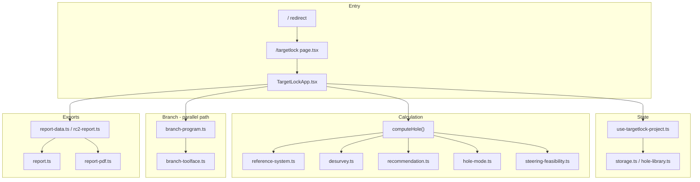

# TargetLock IQ — RC2 Full Institutional Audit

**Audit date:** 2026-06-07  
**Auditor role:** Technical / product institutional audit (pre–drilling-company pilot)  
**App:** `packages/starterkit` → http://localhost:3000/targetlock  
**Version label in code:** `TargetLock IQ v2 RC1` ([`app-version.ts`](../packages/starterkit/src/lib/drilling/app-version.ts))  
**RC2 scope:** Reference-system conversion, reference warnings, near-vertical / high-angle hole advisories, steering-confidence downgrade, RC2 report section — implemented on top of RC1, not a separate release label.

**Prior baseline:** [rc1-general-audit.md](../targetlock-pitch/rc1-general-audit.md) (2026-06-04). That audit predates RC2 features and does not cover them.

---

## Executive summary

**Verdict: Conditionally pilot-ready for controlled internal demo and supervisor review; not ready for paid pilot or production without documented fixes and field validation.**

TargetLock IQ’s **core trajectory math pipeline is sound and well-tested**. The RC2 reference-system layer converts plan and survey azimuths to true north before desurvey, applies display conversion only at the recommendation output boundary, and surfaces mixed-reference warnings. Near-vertical hole mode correctly downgrades steering confidence once in the calculation path, and the UI shows appropriate directional limitations (no toolface/motor control claims).

**Trust risks for a real drilling company pilot** come from **documentation drift**, **version naming confusion (RC1 vs RC2)**, **gaps in Simple-mode discoverability of reference warnings**, **report header confidence not matching RC2 downgraded confidence**, **incomplete pitch sample exports**, **missing sign-convention help on grid rotation / declination fields**, and **smoke tests that do not exercise RC2**. No catastrophic math bugs were found in automated tests, but institutional readiness requires fixing communication and metadata consistency before operations managers or paying clients rely on outputs.

**What the app can do today:** Compare plan vs actual trajectory, project miss, recommend next-interval dip/azimuth aim, assess steering feasibility, handle mixed north references internally, warn on steep-hole behaviour, support branch/daughter planning (advisory), export TXT/PDF handover reports, persist multi-hole projects in browser storage.

**What it must not be used for yet:** Certified survey deliverables, rig toolface/motor control, authoritative desurvey sign-off, multi-user production workspace, or live drilling decisions without site validation and supervisor/geologist approval.

---

## Current app capability summary

| Capability | Status | Notes |
|------------|--------|-------|
| Min-curve desurvey, offset, projected miss, DLS-limited aim | **Working** | 260 automated tests pass |
| Steering feasibility / recovery action plan | **Working** | Configurable capability assumptions per hole |
| Reference system (grid / true / magnetic) | **Working** | Internal true north; output reference for display |
| Reference warnings (mixed ref, zero declination, zero grid rotation) | **Working** | UI: Advanced Setup + Validation only |
| Near-vertical / high-angle advisories | **Working** | 75° / 85° thresholds; confidence downgrade |
| Branch / daughter program (Phase 2) | **Working** | Kickoff from actual mother; toolface estimate advisory |
| CSV import (Import Assistant) | **Working** | Validation and templates |
| TXT / PDF handover export | **Working** | RC2 section present; some metadata gaps |
| Hole package JSON export/import | **Working** | Branch program round-trip tested |
| Multi-hole library (localStorage) | **Working** | Legacy migration on load |
| Guide Center (quick / standard / branch) | **Working** | Does not cover RC2 reference system |
| HUB-IQ live API | **Not implemented** | CSV/templates only |
| Certified validation package | **Not implemented** | Advisory uncertainty only |
| Auth / multi-user deployment | **Not implemented** | Public URL = convenience only |

---

## Architecture map



### Primary file inventory

| Area | Paths |
|------|-------|
| Route / shell | `src/app/targetlock/page.tsx`, `TargetLockApp.tsx`, `layout.tsx`, `targetlock.css` |
| Project state | `src/hooks/use-targetlock-project.ts` |
| Calculation | `src/lib/drilling/compute.ts`, `desurvey.ts`, `geometry.ts`, `recommendation.ts`, `steering-feasibility.ts`, `hole-mode.ts`, `reference-system.ts` |
| Branch | `branch-program.ts`, `branch-program-library.ts`, `branch-toolface.ts`, `branch-report-*.ts` |
| Validation | `validation.ts`, `sidebar-input-validation.ts`, `csv-import-assistant.ts`, `storage-health.ts` |
| Reports | `report.ts`, `report-data.ts`, `report-pdf.ts`, `report-pdf-layout.ts`, `rc2-report.ts` |
| UI panels | `src/components/dashboard/*`, `src/components/charts/*`, `src/components/pitch/*` |
| Tests | `src/lib/drilling/__tests__/` (42 files), `src/hooks/__tests__/`, `src/components/layout/__tests__/` |
| Pitch docs | `docs/targetlock-pitch/` (40+ files) |
| Smoke | `scripts/pilot-gate-smoke.mjs` |

---

## Calculation pipeline map

### `computeHole()` call chain

```
computeHole()                          [compute.ts]
├── normalizeReferenceSystem()
├── buildReferenceWarnings()
├── convertSurveyRecordsReference() ×2 (plan → true, actual → true)
│   └── toTrueAzimuth() → normalizeAzimuth()
├── buildStations() ×2                 [desurvey.ts]
│   └── minCurveDisplacement(), doglegDeg(), vectorFromDipAz()
├── calculateRecommendation()          [recommendation.ts]
│   └── positionOnPlanAtMd(), vector math
├── assessHoleMode(current.dip)        [hole-mode.ts] — uses |dip|
├── computeSteeringFeasibility()
│   └── adjustConfidenceForHoleMode() — SINGLE downgrade
└── convertRecommendationForDisplay() — fromTrueAzimuth on reco azimuths only
```

### Audit findings — calculation pipeline

| Check | Result | Evidence |
|-------|--------|----------|
| Plan/actual converted before desurvey | **PASS** | `compute.ts` L77-81; `compute.test.ts` mixed-ref alignment test |
| Internal math uses true north | **PASS** | Stations built from converted records; `rc2-report.ts` documents internal true north |
| Display azimuth conversion | **PASS** | Only `convertRecommendationForDisplay()` converts reco azimuths; chart tooltips use station azimuths (true-north internal values when output ≠ true — charts show internal values, not re-converted for grid display) |
| Double conversion | **PASS (reco path)** | No second `toTrueAzimuth` on already-true records when `fromReference === "true"` |
| Chart azimuth display vs output reference | **WATCH** | Charts/tooltips show internal (true-north) azimuths even when `outputReference` is grid/magnetic; only action-plan/reco display values are converted. Field users comparing chart tooltip to “display output” setting may see a mismatch. |
| Saved project reload parity | **PASS (code path)** | `referenceSystem` persisted on `SavedHoleProject`; `applyProjectToState` normalizes on load; auto-save includes `referenceSystem` in snapshot |
| Missing/invalid reference config | **PASS** | `normalizeReferenceSystem()` falls back to grid/0; warnings generated, not silent |
| Negative dip in hole mode | **PASS** | `assessHoleMode` uses `Math.abs(currentDip)` |
| Confidence downgrade once | **PASS** | Single `adjustConfidenceForHoleMode` in `buildSteeringFeasibility` |
| Hole mode uses latest actual dip | **PASS** | `assessHoleMode(recommendationRaw.current.dip)` where `current` is last actual station |

### Bugs / conflicts — calculation

| ID | Severity | Issue |
|----|----------|-------|
| CALC-1 | Medium | Chart/tooltip azimuths may not match `outputReference` when user sets display to grid/magnetic — only recommendation fields are converted for display. |
| CALC-2 | Low | Near-vertical threshold **85°** (`hole-mode.ts`) vs toolface near-vertical **80°** (`branch-toolface.ts`) — inconsistent messaging between main hole advisory and branch toolface card. |

---

## Reference system audit

### Model ([`reference-system.ts`](../packages/starterkit/src/lib/drilling/reference-system.ts))

- **Grid → true:** `azimuth + gridRotationDeg` (documented in JSDoc)
- **Magnetic → true:** `azimuth + magneticDeclinationDeg` (east-positive declination)
- **Warnings:** mixed plan/survey reference; magnetic with 0° declination; grid with 0° rotation (info)

### State and duplicate source-of-truth

| Source | Role |
|--------|------|
| `referenceSystem` (SavedHoleProject) | **Authoritative for `computeHole()`** |
| `surveyToolProfile.northReference` | Used for survey uncertainty summary text only |

**Sync behaviour:** `setReferenceSystem()` in `use-targetlock-project.ts` updates `surveyToolProfile.northReference` to match `surveyReference`. **Reverse sync does not exist** — changing north reference in Survey Tool Profile does not update `referenceSystem.surveyReference`. Preset changes via `profileFromPreset()` can reset `northReference` independently.

**Risk:** User can believe survey tool north reference drives trajectory math when it does not. Trajectory uses `referenceSystem` only.

### UI ([`ReferenceSystemPanel.tsx`](../packages/starterkit/src/components/dashboard/ReferenceSystemPanel.tsx))

| Check | Result |
|-------|--------|
| Plan / survey / output selectors | **PASS** |
| Grid rotation & declination inputs | **PASS** — numeric fields present |
| Positive/negative sign explanation | **FAIL** — no inline help on whether rotation/declination are added or subtracted; conventions only in code JSDoc |
| Field validation prompt | **PASS** — “ask your operations manager” note |
| Simple mode visibility | **FAIL** — panel only in Advanced → Setup |
| Validation tab warnings | **PASS** — `ValidationPanel` shows reference warnings when present |

### Tests

`reference-system.test.ts`: wraparound 370→10, -10→350, magnetic/grid conversion, round-trip, mixed-ref warning, zero declination, zero grid rotation. **No explicit test at exactly 0° and 360° boundary for conversion chain** (partial gap).

---

## Vertical hole / hole mode audit

| Check | Result |
|-------|--------|
| Classification uses latest actual \|dip\| | **PASS** |
| Thresholds 75° / 85° | **PASS** — tested in `hole-mode.test.ts` |
| Confidence downgrade once | **PASS** |
| Simple mode advisory | **PASS** — `ActionPlanPanel` embeds `HoleModeAdvisoryPanel`; confidence tag uses `steering.recoveryConfidence` when hole mode ≠ angle |
| Toolface/motor disclaimers | **PASS** — `HoleModeAdvisoryPanel`, `MethodPurposePanel`, `branch-toolface.ts`, `ToolfaceEstimateCard` |
| Reports include hole mode & downgrade | **PASS** — RC2 section via `buildRc2ReportContext` when options passed |
| Guide / walkthrough coverage | **FAIL** — `guide-flows.ts` has zero mentions of reference system or near-vertical advisories |

### Scenario verification (automated)

- `test-scenarios.test.ts` — **Reference system** scenario: On track after mixed-ref conversion; mixed-reference warning present.
- **Near-vertical** scenario: `holeModeAssessment.mode === "near-vertical"`; `steering.simple.confidence !== baseRecoveryConfidence(reco)`.

---

## Drilling domain language audit

| Topic | Finding |
|-------|---------|
| RL vs TVD vs D | App uses **Down (D)** and labels “Down / TVD” in conventions (`validation.ts`) — positive down from collar. **No “RL” terminology** found in UI (reduces RL/elevation confusion). |
| Collar coordinates | Collar assumed at **E0 N0 D0**; charts mark collar at origin. Reports show **target offset (E/N/D)** but **no explicit collar coordinate block** (acceptable for collar-relative model; must be stated in pilot brief). |
| Hole length vs RL difference | Target **MD** used for depth along hole; offsets are plan/actual E/N/D — no conflation found. |
| Lift/drop/swing/left/right | Consistent in `recommendation.ts` (`dipInstruction`, `azimuthInstruction`) and `steering-feasibility.ts` (`liftDropLabel`, `swingLabel`). |
| Demo wording | InfoTip still says “Target is an offset from the collar **in this demo**” — slightly undermines production tone. |

---

## Guide and documentation audit

### Stale / contradictory references

| Document | Stated | Actual (2026-06-07) | Severity |
|----------|--------|---------------------|----------|
| [current-status.md](../targetlock-pitch/current-status.md) | 152+ tests, 7 built-in scenarios | **260 tests**, **9** built-in scenarios | High |
| [validation-plan.md](../targetlock-pitch/validation-plan.md) | 152+ tests | 260 tests | Medium |
| [final-pilot-gate.md](../targetlock-pitch/final-pilot-gate.md) | 213 tests | 260 tests (suite grew) | Medium |
| [README.md](../targetlock-pitch/README.md) index | 7 synthetic holes, v2 RC1 pilot-ready | 9 scenarios; RC2 features shipped in app | High |
| [known-limitations.md](../targetlock-pitch/pilot-testing-kit/known-limitations.md) | RC1 only | No RC2 reference system, near-vertical, confidence downgrade | High |
| [app-version.ts](../packages/starterkit/src/lib/drilling/app-version.ts) | `v2 RC1` | Method & Purpose has “RC2 changelog”; reports section titled “RC2” | High (naming) |
| [guide-center.md](../targetlock-pitch/pilot-testing-kit/guide-center.md) | Standard 20-step workflow | No step for Reference system panel | Medium |
| [copy-audit-rc1.md](../targetlock-pitch/copy-audit-rc1.md) | RC1 copy audit | Pre-RC2 | Medium |
| [rc1-general-audit.md](../targetlock-pitch/rc1-general-audit.md) | Pilot-ready RC1 | RC2 not assessed | Superseded by this doc |

### In-app documentation

| Source | RC2 coverage |
|--------|----------------|
| `MethodPurposePanel.tsx` | **Good** — RC2 changelog, directional limitations, decision support |
| `GuideCenterModal` / `guide-flows.ts` | **Gap** — no reference system or steep-hole steps |
| `MathReferencePanel` | Trajectory math; verify reference conversion mentioned in live panel (not re-audited line-by-line in this pass) |
| `ReferenceSystemPanel` | Operational copy good; sign conventions weak |

### Required disclaimer topics — coverage

| Topic | In app UI | In HANDOVER_DISCLAIMER | In known-limitations.md |
|-------|-----------|------------------------|-------------------------|
| Decision support only | Yes | Yes | Yes |
| Not certified survey deliverable | Yes (tool profile tip) | **No** | Partial |
| Not toolface/motor control | Yes | **No** | Yes (branch) |
| Grid/true/magnetic handling | Yes (Setup) | Via RC2 section when exported | **No** |
| Near-vertical advisories | Yes | Via RC2 section | **No** |
| Confidence downgrades | Yes (action plan) | RC2 section | **No** |

---

## Export / report audit

### Metadata checklist (institutional)

| Field | TXT | PDF | On-screen parity | Notes |
|-------|-----|-----|------------------|-------|
| Hole name / site | Yes | Yes | Yes | |
| Collar coordinates | **No** | **No** | Implicit 0,0,0 | Document as convention |
| Target E/N/D | Yes | Yes | Yes | |
| Plan / survey / output reference | Yes (RC2) | Yes (appendix keyValues) | Advanced Setup | |
| Grid rotation / declination | Yes (RC2) | Yes | Setup | |
| Hole mode | Yes (RC2) | Yes | Action plan / Steering | |
| Steering confidence (reported) | Recovery section | Yes | Action plan tag | |
| Base vs reported confidence | RC2 section | Yes | Partial | |
| Confidence downgrade reason | RC2 when downgrade | Yes | Hole mode context | |
| Reference warnings | When passed to export | Yes | Setup/Validation | |
| Limitation disclaimer | Footer | Appendix | N/A | Missing certified/toolface lines |
| Timestamp / version | Yes | Yes | Sidebar version tag | Version still says RC1 |
| Test scenario name | When active | Yes | Yes | |

### Report bugs / gaps

| ID | Issue |
|----|-------|
| RPT-1 | **Report header `Confidence`** uses `reco.classification.confidence` ([`report-data.ts`](../packages/starterkit/src/lib/drilling/report-data.ts) L185), not downgraded `steering.simple.confidence`. On near-vertical holes, header can disagree with action plan tag and RC2 “Reported confidence”. |
| RPT-2 | Pitch sample generator ([`generate-pitch-samples.test.ts`](../packages/starterkit/src/lib/drilling/__tests__/generate-pitch-samples.test.ts)) does **not** pass `referenceSystem`, `referenceWarnings`, or `holeModeAssessment` — checked-in [DDH-0247-handover-md390.txt](../targetlock-pitch/samples/DDH-0247-handover-md390.txt) is an incomplete RC2 institutional example (no reference warnings block despite default grid-zero info warning). |
| RPT-3 | `HANDOVER_DISCLAIMER` omits explicit “not a certified survey deliverable” and “not toolface/motor control software” (present elsewhere in UI). |

### CSV import/export

- Templates in `public/templates/`
- Import Assistant: column mapping, validation, collar-not-at-0 warning
- Export via `surveysToCsv()` and package JSON — reference system included in saved project, not in CSV columns (expected)

---

## UI/UX audit (code + contract review)

| Check | Result |
|-------|--------|
| Simple vs Advanced mode toggle | **PASS** — `TargetLockApp.tsx` |
| RC2 controls discoverability | **Mixed** — hole mode in Simple; reference system Advanced-only |
| Validation tab actionable | **PASS** — sanity, reference CSV compare, sign-off, reference warnings |
| Dead buttons / empty panels | **Not manually browser-tested** — smoke script covers Guide, Scenario lab, export buttons |
| Guide non-destructive restore | **PASS** — documented and tested in `guide-mode.test.ts` |
| Mobile/tablet | **Not assessed** — field use often tablet; layout not verified in this audit session |

---

## Test / build results

**Environment:** Windows 10, `packages/starterkit`, audit run 2026-06-07.

| Command | Result | Detail |
|---------|--------|--------|
| `npm run lint` (`tsc --noEmit`) | **PASS** | Exit 0 |
| `npm run test` (`vitest run`) | **PASS** | **260 tests**, 44 files, 0 failures |
| `npm run build` (`next build`) | **FAIL** | Turbopack could not fetch Google Fonts (DM Sans, IBM Plex Sans) — network/environment failure in audit session. Prior [final-pilot-gate.md](../targetlock-pitch/final-pilot-gate.md) recorded **PASS** on 2026-06-05. |
| `npm run smoke:pilot` | **NOT RUN** | Requires production server; blocked by build failure in this session |

**Test count drift:** Pitch docs cite 152+ or 213 tests; actual suite is **260 tests** (includes RC2, branch, report, math validation, etc.).

**Smoke gap:** `pilot-gate-smoke.mjs` validates Guide, Scenario lab, mode toggle, Export TXT/PDF buttons, console errors — **no RC2 panel, no export content assertions, no reference-system scenario**.

---

## Bugs found

| ID | Priority | Description |
|----|----------|-------------|
| BUG-1 | P1 | Report header confidence ≠ RC2 downgraded steering confidence on steep holes |
| BUG-2 | P1 | `surveyToolProfile.northReference` can desync from `referenceSystem.surveyReference` |
| BUG-3 | P2 | Chart/tooltip azimuth may not respect `outputReference` display setting |
| BUG-4 | P2 | Pitch sample export omits full RC2 context (warnings, hole mode options) |
| BUG-5 | P3 | Near-vertical threshold mismatch: 85° hole mode vs 80° branch toolface |

No failing unit tests. No desurvey math regression detected.

---

## Conflicts found

| ID | Conflict |
|----|----------|
| CON-1 | Version string **RC1** vs feature label **RC2** in reports and Method & Purpose |
| CON-2 | Action plan confidence tag uses steering confidence on steep holes; report header uses classification confidence |
| CON-3 | Survey tool profile north reference displayed to user but not authoritative for math |
| CON-4 | Guide Center standard workflow references Survey Tool Profile (step 15) but not Reference System panel |
| CON-5 | `known-limitations.md` and pitch README still describe RC1-only pilot scope |

---

## Stale docs found

1. `docs/targetlock-pitch/current-status.md` — test count, scenario count, RC2 features absent  
2. `docs/targetlock-pitch/README.md` — 7 scenarios, RC1-only framing  
3. `docs/targetlock-pitch/validation-plan.md` — 152+ tests  
4. `docs/targetlock-pitch/final-pilot-gate.md` — 213 tests (undercount)  
5. `docs/targetlock-pitch/pilot-testing-kit/known-limitations.md` — no RC2  
6. `docs/targetlock-pitch/pilot-testing-kit/guide-center.md` — no reference-system step  
7. `docs/targetlock-pitch/copy-audit-rc1.md` / `rc1-general-audit.md` — pre-RC2, still linked as current audit  
8. `docs/targetlock-pitch/release-candidate-checklist.md` — 213+ tests, RC1 version checks  

---

## Risk register

| Risk | Likelihood | Impact | Mitigation |
|------|------------|--------|------------|
| Wrong azimuth due to mixed north refs | Medium | High | Reference warnings + Validation tab; **fix Simple-mode visibility** |
| User trusts header confidence on steep hole | Medium | High | **Fix RPT-1**; emphasize RC2 section in pilot brief |
| Pilot expects RC2 release label | High | Medium | Clarify RC2 = feature batch; update version/docs |
| Browser data loss | Medium | High | Export hole package before experiments (documented) |
| Build fails offline / air-gapped | Low | Medium | Self-host fonts or bundle locally |
| Branch toolface treated as rig instruction | Medium | High | Disclaimers present — reinforce in training |
| Stale pitch doc misleads ops manager | High | Medium | Update docs per action checklist |
| No HUB-IQ API | High | Low (pilot) | CSV workflow documented |

---

## Commercial pilot readiness

| Level | Ready? | Why | Fix first |
|-------|--------|-----|-----------|
| **Internal demo** | **Yes** | Core workflows work; 260 tests pass; scenarios #1–#9 available | Update stale README for demo script accuracy |
| **Supervisor review** | **Yes, with caveats** | Reports and validation tab support review; RC2 metadata in exports when options passed | Fix report header confidence; refresh pitch samples |
| **Operations manager pilot** | **Conditional** | Reference system needs clearer sign conventions and Simple-mode warning path; docs must match app | P0/P1 items in checklist |
| **Paid pilot** | **No** | No certified validation against client reference data; localStorage only; version/doc confusion undermines trust | P1 + P2 + field validation evidence |
| **Production deployment** | **No** | No auth, no shared storage, no SLA, advisory-only positioning | Roadmap: HUB-IQ, sign-off workflow, hosted multi-user |

---

## Recommended next roadmap

1. **Documentation alignment** — Single source of truth for version name, test count (260), scenario count (9), RC2 capabilities.  
2. **Report integrity** — Header confidence = reported steering confidence when hole mode downgrade applies; strengthen disclaimer.  
3. **Reference UX** — Sign convention help; bidirectional or single source for north reference; Simple-mode reference warning banner.  
4. **Guide Center** — Add steps for Reference system and near-vertical advisories.  
5. **Smoke tests** — Extend `smoke:pilot` for RC2 section in export and Setup panel.  
6. **Field validation** — Reference CSV compare workflow with client desurvey output (per validation-plan.md).  
7. **HUB-IQ integration** — Post-pilot if CSV workflow validated.

---

## Priority list

### P0 — Must fix before anyone tests (external)

1. Update pilot-facing docs (`known-limitations.md`, `README.md`, `current-status.md`) to describe RC2 behaviour and correct test/scenario counts.  
2. Brief pilot users: **decision support only**; confirm reference system settings before trusting azimuth guidance.  
3. Verify production build in connected environment (fonts) before sharing URL.

### P1 — Must fix before drilling-company pilot

1. Fix report header confidence to match RC2 reported steering confidence ([BUG-1]).  
2. Resolve `surveyToolProfile.northReference` ↔ `referenceSystem` desync or remove duplicate control ([BUG-2]).  
3. Add grid rotation / magnetic declination sign convention help in Reference System panel.  
4. Surface reference warnings in Simple mode (banner or action plan) when severity = warning.  
5. Regenerate pitch samples with full RC2 export options ([BUG-4]).  
6. Extend smoke test to load scenario #8 and assert RC2 section text.  
7. Strengthen `HANDOVER_DISCLAIMER` with certified-survey and toolface exclusions.

### P2 — Should fix before paid pilot

1. Align chart/tooltip azimuth with `outputReference` or label charts “internal true north” ([BUG-3]).  
2. Unify near-vertical thresholds (85° vs 80°) or document why they differ ([BUG-5]).  
3. Update Guide Center standard workflow with reference-system step.  
4. Bump version label strategy (RC1+RC2 vs RC2) across app, PDF, and docs ([CON-1]).  
5. Add hole-package round-trip test including `referenceSystem` field.

### P3 — Future improvements

1. Explicit collar coordinate fields for mine-grid collar positions.  
2. HUB-IQ / SURVEY-IQ API integration.  
3. Full approval sign-off workflow with locked state.  
4. Offline PWA / IndexedDB sync (per Roadmap panel).  
5. ESLint via `next lint` (currently `tsc` only).  
6. Playwright config with institutional regression suite.

---

## What TargetLock IQ can do in its current state

- Load plan and actual surveys (CSV or manual), desurvey with minimum curvature, and show plan vs actual offset and projected miss.  
- Recommend next-interval dip and azimuth aim with lift/drop and swing left/right language.  
- Assess whether correction fits configured DLS limits and suggest recovery methods (parameter, motor/Navi, DeviDrill, wedge/branch review).  
- Convert mixed grid/true/magnetic azimuth inputs through true north before math, with warnings when configuration looks incomplete.  
- Downgrade steering confidence on high-angle and near-vertical holes and explain why in RC2 report section.  
- Support multi-hole library, scenario lab (9 built-in holes), branch/daughter planning with advisory toolface estimate.  
- Export shift handover TXT/PDF with trajectory visual, validation status, and governance history.

## What TargetLock IQ should NOT yet be used for

- **Certified survey deliverables** or contractual sign-off on hole position.  
- **Rig toolface, motor yield, or directional tool control** — estimates are planning discussion only.  
- **Sole basis for live steering decisions** without driller, supervisor, geologist, and directional contractor review.  
- **Multi-user production** or audit trail across crews (browser-local storage only).  
- **Sites with complex north-reference workflows** without explicit validation of grid rotation and declination signs.  
- **Paid commercial reliance** without field validation against site reference desurvey and updated institutional documentation.

---

## Related documents

- [Action checklist](./targetlock-iq-rc2-action-checklist.md)  
- [RC1 general audit](../targetlock-pitch/rc1-general-audit.md) (superseded for RC2 scope)  
- [Test scenarios](../targetlock-pitch/test-scenarios.md)  
- [Final pilot gate](../targetlock-pitch/final-pilot-gate.md)  

**Audit completed:** 2026-06-07
